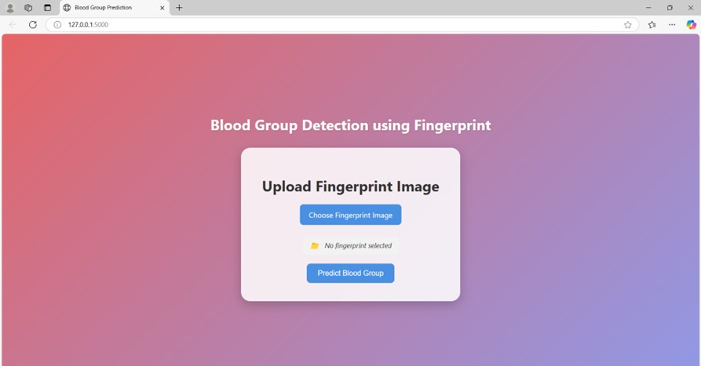
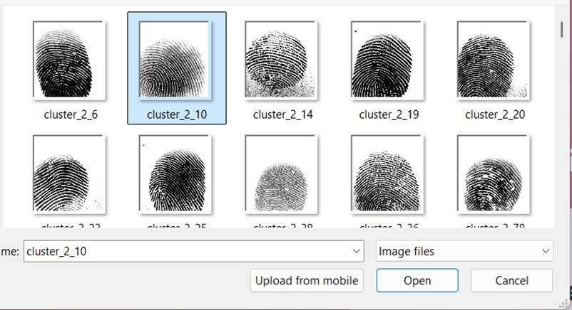
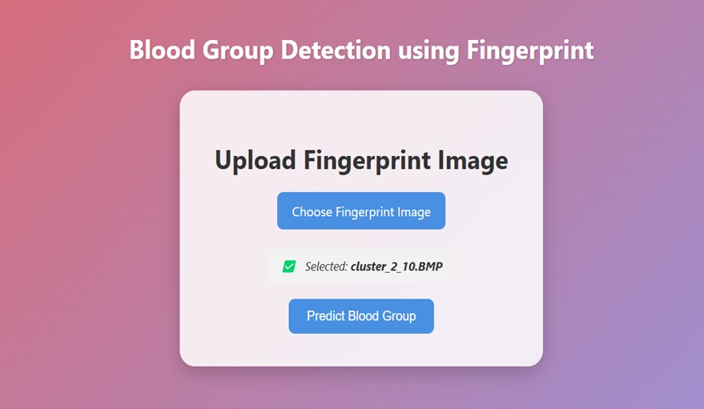
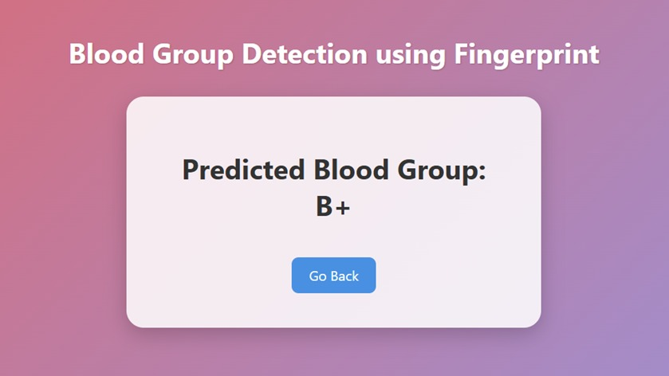

# -Blood-Group-Detection-Using-Fingerprint-

# 🩸 Blood Group Detection Using Fingerprint

An AI-powered web application that predicts a person's blood group using fingerprint images.
This project leverages Deep Learning with TensorFlow and provides an interactive interface using Flask.

---

## 📸 Screenshots



> 
>
> > 
> >
> > > 


> 

---

## 🧠 Features

* 🔍 Predict blood group from fingerprint image
* 🤖 Deep Learning model (TensorFlow / Keras)
* 🌐 Flask-based web interface
* 📤 Image upload functionality
* ⚡ Real-time prediction output

---

## 🛠️ Tech Stack

* **Frontend:** HTML, CSS
* **Backend:** Flask (Python)
* **Machine Learning:** TensorFlow, Keras
* **Libraries:** NumPy, Pillow

---

## 📂 Project Structure

```
project/
│── app.py
│── requirements.txt
│── model/
│     └── blood_group_predictor.h5 (not included)
│── templates/
│     ├── index.html
│     └── result.html
│── static/
│     └── uploads/
│── README.md
```

---

## ⚙️ Installation & Setup

### 1️⃣ Clone the repository

```bash
git clone https://github.com/SimranSuri30/-Blood-Group-Detection-Using-Fingerprint-.git
cd -Blood-Group-Detection-Using-Fingerprint-
```

---

### 2️⃣ Create virtual environment

```bash
python -m venv venv
venv\Scripts\activate
```

---

### 3️⃣ Install dependencies

```bash
pip install -r requirements.txt
```

---

## 📥 Model Download (IMPORTANT)

⚠️ The trained model is not included in this repository due to size limitations.

👉 Download the model from Google Drive:
🔗 **[Download Model Here](https://drive.google.com/drive/folders/10K5fL_odXM6Q-2l5d7YJe4Nq1pGVTnGk?usp=drive_link)**

After downloading, place it inside:

```
model/blood_group_predictor.h5
```

---

## ▶️ Run the Application

```bash
python app.py
```

Then open:

```
http://127.0.0.1:5000/
```

---

## 📊 Output

The model predicts one of the following blood groups:

```
A+, A-, B+, B-, AB+, AB-, O+, O-
```

---

## ⚠️ Notes

* Ensure the model file is placed correctly before running
* Upload clear fingerprint images for better accuracy
* This project is for educational/research purposes

---

## 🔮 Future Improvements

* 🎨 Better UI (React / Next.js Dashboard)
* ☁️ Deployment (Render / AWS)
* 📈 Model accuracy improvement
* 📊 Analytics dashboard

---

## 👩‍💻 Author

**Simran Suri**
🔗 GitHub: https://github.com/SimranSuri30

---

## ⭐ If you like this project

Give it a ⭐ on GitHub and share your feedback!
